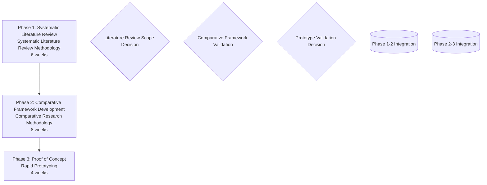
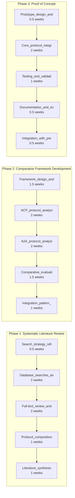
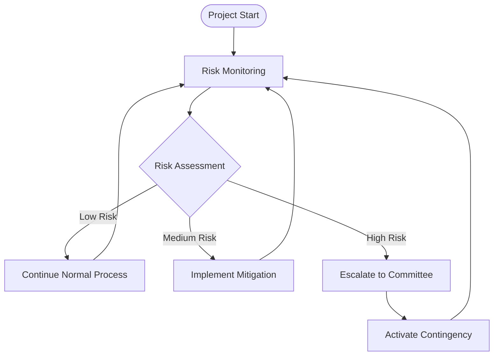

# Research Methodology Workflow Diagrams (Task 5.3.4)
*Generated: 2025-06-04T08:53:27.320801*
*Based on: Hybrid methodology approach with optimized timeline and risk management*

## Executive Summary

This document provides comprehensive workflow diagrams for the hybrid methodology approach, including high-level process flows, detailed activity workflows, and risk management procedures. The workflows are designed to support the optimized 18.95-week timeline while maintaining research quality and managing identified risks.

## High-Level Methodology Workflow

### Process Overview

#### Phase 1: Systematic Literature Review
- **Methodology**: Systematic Literature Review Methodology
- **Duration**: 6 weeks
- **Key Inputs**: Research objectives, Literature search strategy, Initial scope definition
- **Key Outputs**: Comprehensive literature synthesis, Protocol composition patterns, Research gaps identification, Theoretical framework validation

#### Phase 2: Comparative Framework Development
- **Methodology**: Comparative Research Methodology
- **Duration**: 8 weeks
- **Key Inputs**: Outputs from Phase 1: Systematic Literature Review, Phase transition validation
- **Key Outputs**: ACP protocol analysis, A2A protocol analysis, Comparative evaluation framework, Integration pattern assessment, Protocol composition recommendations

#### Phase 3: Proof of Concept
- **Methodology**: Rapid Prototyping
- **Duration**: 4 weeks
- **Key Inputs**: Outputs from Phase 2: Comparative Framework Development, Phase transition validation
- **Key Outputs**: Protocol integration prototype, Testing and validation results, Implementation documentation, Proof of concept demonstration

### Critical Decision Points

#### Literature Review Scope Decision
- **Location**: End of Phase 1
- **Criteria**: Sufficient literature coverage, Clear research gaps identified, Framework validated
- **Possible Outcomes**: Proceed to Phase 2, Expand literature scope, Refine research questions

#### Comparative Framework Validation
- **Location**: End of Phase 2
- **Criteria**: Framework robustness confirmed, Protocol analysis complete, Integration patterns clear
- **Possible Outcomes**: Proceed to Phase 3, Refine framework, Additional protocol analysis

#### Prototype Validation Decision
- **Location**: End of Phase 3
- **Criteria**: Prototype demonstrates key concepts, Integration feasibility confirmed, Research objectives met
- **Possible Outcomes**: Complete project, Extend prototype, Additional validation

### Integration Gates

#### Phase 1-2 Integration
- **Timing**: Week 5.5
- **Purpose**: Early transfer of literature findings to comparative framework
- **Activities**: Preliminary framework design, Early gap identification, Framework pre-validation

#### Phase 2-3 Integration
- **Timing**: Week 13.5
- **Purpose**: Early transfer of comparative insights to prototype design
- **Activities**: Prototype architecture planning, Technical requirements specification, Early design validation

### Visual Workflow (Mermaid Syntax)

## Detailed Activity Workflow

### Phase 1: Systematic Literature Review

| Activity | Duration | Optimization | Inputs | Outputs |
|----------|----------|--------------|--------|---------|
| Search strategy refinement | 0.5 weeks | Parallel with initial searches | Research objectives, Initial literature | Refined search strategy, Database selection |
| Database searches and screening | 2 weeks | Accelerated screening with AI tools | Search strategy, Database access | Initial paper list, Screening results |
| Full-text review and data extraction | 2 weeks | Focused on high-impact papers | Standard | Standard |
| Protocol composition pattern analysis | 1 weeks | Concurrent with synthesis | Standard | Standard |
| Literature synthesis and gap identification | 1 weeks | Streamlined synthesis process | Standard | Standard |

**Critical Activities**: Database searches and screening, Full-text review and data extraction

### Phase 2: Comparative Framework Development

| Activity | Duration | Optimization | Inputs | Outputs |
|----------|----------|--------------|--------|---------|
| Framework design and validation | 1.5 weeks | Leverage literature findings directly | Literature findings, Research objectives | Comparison framework, Evaluation criteria |
| ACP protocol analysis | 2 weeks | Focused analysis using established framework | Protocol specifications, Analysis framework | Protocol evaluation, Feature analysis |
| A2A protocol analysis | 2 weeks | Parallel validation with ACP insights | Protocol specifications, Analysis framework | Protocol evaluation, Feature analysis |
| Comparative evaluation | 1.5 weeks | Concurrent with final analysis | Standard | Standard |
| Integration pattern assessment | 1 weeks | Streamlined integration focus | Standard | Standard |

**Critical Activities**: ACP protocol analysis, A2A protocol analysis

### Phase 3: Proof of Concept

| Activity | Duration | Optimization | Inputs | Outputs |
|----------|----------|--------------|--------|---------|
| Prototype design and specification | 0.5 weeks | Use comparative insights directly | Design specifications, Protocol insights | Working prototype, Integration demonstration |
| Core protocol integration development | 2 weeks | Focused on key integration points | Standard | Standard |
| Testing and validation | 1 weeks | Simplified validation criteria | Standard | Standard |
| Documentation and evaluation | 0.5 weeks | Concurrent with testing | Standard | Standard |
| Integration with previous findings | 0.5 weeks | Continuous integration approach | Standard | Standard |

**Critical Activities**: Core protocol integration development

### Parallel Processes

#### Literature review optimization
- **Timing**: Weeks 1-1.5
- **Activities**: Search strategy development, Initial database searches
- **Time Savings**: 0.5 weeks
- **Coordination**: Regular sync meetings, Shared documentation, Progress coordination

#### Comparative analysis optimization
- **Timing**: Weeks 6.5-7
- **Activities**: Framework validation, Protocol analysis preparation
- **Time Savings**: 0.5 weeks
- **Coordination**: Regular sync meetings, Shared documentation, Progress coordination

#### Prototyping optimization
- **Timing**: Weeks 3.5-4
- **Activities**: Documentation, Testing, Evaluation
- **Time Savings**: 1 week
- **Coordination**: Regular sync meetings, Shared documentation, Progress coordination

### Detailed Activity Flow (Mermaid Syntax)

## Risk Management Workflow

### Risk Monitoring Process

| Risk Category | Frequency | Method | Escalation Trigger |
|---------------|-----------|--------|-------------------|
| Protocol Evolution | Bi-weekly | Literature alerts and protocol specification monitoring | Major protocol updates affecting research scope |
| Integration Quality | End of each phase | Integration review and supervisor feedback | Difficulty synthesizing findings across phases |
| Timeline Adherence | Weekly | Progress tracking against milestones | Two consecutive weeks behind schedule |

### Escalation Procedures

#### Level 1 - Routine Issues
- **Triggers**: Minor schedule delays, Quality concerns
- **Response Team**: Researcher, Supervisor
- **Response Time**: Within 24 hours
- **Workflow Steps**:
  1. Researcher identifies issue
  1. Consult with supervisor
  1. Implement immediate response
  1. Document resolution

#### Level 2 - Significant Issues
- **Triggers**: Major timeline impact, Scope changes
- **Response Team**: Researcher, Supervisor, Program coordinator
- **Response Time**: Within 48 hours
- **Workflow Steps**:
  1. Formal issue documentation
  1. Stakeholder consultation
  1. Develop response plan
  1. Implement with monitoring
  1. Formal resolution report

#### Level 3 - Critical Issues
- **Triggers**: Project viability threat, Fundamental methodology issues
- **Response Team**: Full academic committee
- **Response Time**: Within 72 hours
- **Workflow Steps**:
  1. Emergency committee convening
  1. Comprehensive issue assessment
  1. Alternative strategy development
  1. Formal approval process
  1. Implementation with close monitoring

### Risk Management Flow (Mermaid Syntax)

## Implementation Guidelines

### Workflow Execution Principles

1. **Sequential Phase Execution**: Complete each phase before proceeding to the next
2. **Gate-Based Validation**: Validate completion criteria at each integration gate
3. **Continuous Risk Monitoring**: Implement ongoing risk assessment throughout
4. **Parallel Activity Coordination**: Manage parallel processes with regular synchronization
5. **Quality Assurance Integration**: Embed quality checks within each workflow step

### Success Factors

- **Clear Role Definition**: Each workflow step has defined responsibilities
- **Regular Communication**: Weekly supervisor meetings and phase reviews
- **Documentation Standards**: Consistent documentation throughout all phases
- **Adaptive Management**: Flexibility to adjust workflows based on emerging needs
- **Stakeholder Engagement**: Regular communication with all project stakeholders

## Conclusion

The workflow diagrams provide a comprehensive roadmap for executing the hybrid methodology approach within the optimized timeline. The integration of high-level process flows, detailed activity management, and systematic risk management ensures both research quality and project deliverability. These workflows serve as living documents that should be adapted as the project progresses and new insights emerge.
